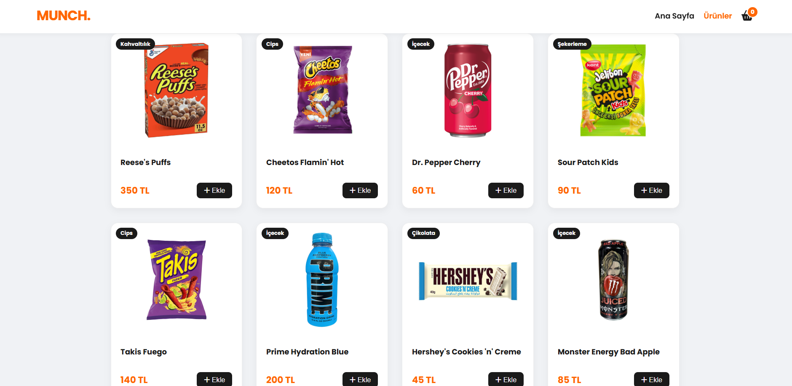
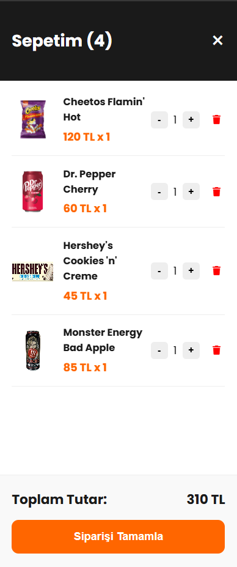

# Munch 🍪 - Imported Snacks E-Commerce Frontend

Munch is a modern, responsive e-commerce interface designed for an imported snack store. It is built entirely with **Vanilla JavaScript** (no frameworks) and utilizes the browser's `localStorage` API for data persistence.

## 🌟 Features

* **Dynamic Product Management:** Product data is rendered dynamically from a JavaScript array.
* **Persistent Shopping Cart (LocalStorage):** Your cart items are saved automatically. Even if you refresh the page or close the browser, your snacks remain in the cart.
* **Off-Canvas Cart UI:** A sleek, sliding sidebar mechanism for the shopping cart.
* **Real-Time Calculations:** Stock counts and total prices update instantly as you interact with the cart.
* **Toast Notifications:** Visual feedback (green pop-up) appears whenever an item is added to the cart.
* **Fully Responsive:** Optimized for both desktop and mobile devices.

## 🛠️ Tech Stack

* **HTML5** (Semantic structure)
* **CSS3** (Flexbox, Grid, CSS Variables, and Animations)
* **JavaScript** (ES6+, DOM Manipulation, LocalStorage API)

## 🚀 Installation & Usage

This is a static project, so you don't need any package managers like npm or yarn.

1.  **Clone** or download this repository.
2.  Open the `index.html` file in your favorite web browser.
3.  That's it! The Munch store is ready to serve.

## 📂 Project Structure

    MUNCH/
    ├── index.html      # Homepage (Hero & Showcase)
    ├── urunler.html    # Product Listing Page
    ├── style.css       # Main Stylesheet
    ├── script.js       # Core Logic & Cart Management
    ├── img/            # Product Images & Assets
    └── README.md       # Project Documentation

## 📄 Lisans

This project is licensed under the [MIT License](LICENSE).

---
**Developed by:** [Mehmet Baysal](https://github.com/baysaI)
